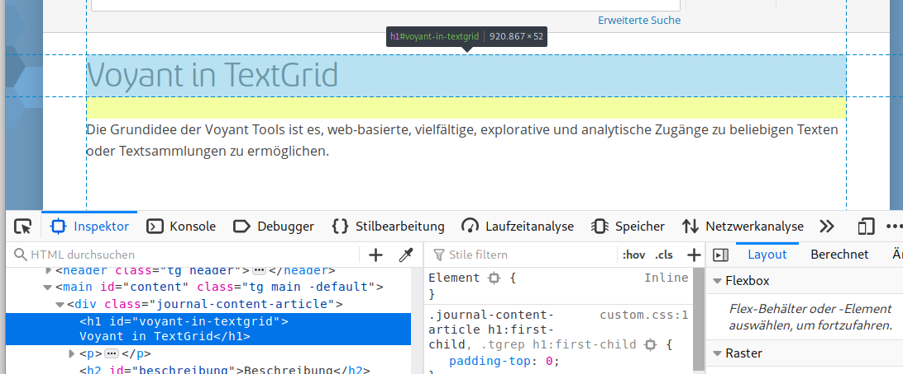

# Factsheets for SSHOC Services

This is the (provisional) Gitlab repository for the factsheets created within SSHOC WP3.6. It is public and consists of the Markdown files (for editing) and the HTML representations (for end users and integration) of the factsheets.

Initially (2021) factsheets have been created for the Virtual Collection Registry and the Language Resource Switchboard. The factsheets are written in [Markdown](https://github.com/adam-p/markdown-here/wiki/Markdown-Cheatsheet) and can be edited very easy in the [._posts](https://gitlab.gwdg.de/buddenbohm/factsheets_sshoc_services/-/tree/master/_posts) directory of this repository if you are included in the member list of the repository. Access for editing may be requested through sbudden@gwdg.de 

Although the factsheets are public and readable already in this Gitlab repository, HTML representations have been created for more end user convenience. The URL naming schema follows https://buddenbohm.pages.gwdg.de/factsheets_sshoc_services/NAME_OF_FACTSHEET_IN_THE-POSTS_DIRECTORY.html and may be easily integrated from various websites. An example how such an integration could like: https://textgridrep.org/browse/tbz8.0?lang=en (Tools, Switchboard, info button).

In case of questions or suggestions write to sbudden@gwdg.de

# Documentation

This folder contains all static pages belonging to the factsheets_sshoc_services. They are all written in [Markdown](https://daringfireball.net/projects/markdown/).

## Naming schema

The files in the [_posts](_posts) directory follow the naming scheme

        [date][pagename].md

Where `pagename` is the identifier used for the page. The `.md` extension identifies the file as Markdown file.

The markdown files are later rendered as html within the SSHOC static docs site <https://buddenbohm.pages.gwdg.de/factsheets_sshoc_services> identified as `pagename.html`.

## Index

The index is autogenerated and lists all docs found in [_posts](_posts). Description and page title are changed in [_config.yml](_config.yaml).

### Linking between pages

Linking between pages is possible. Refer to the 2020-01-01-syntax.md document as to `syntax.html`. Example: 

```markdown
Find more info on the [syntax](syntax.html) page.
```

### Linking within pages / Heading anchors


IDs are genereted for heading elements. Which could be used as anchors, this means that you can link to them.

An Example:

A Markdown snippet

        # A headline

        ## A subsection

will be rendered as HTML Elements

        <h1 id="a headline">A headline</h1>
 
        <h2 id="a-subsection">A subsection</h2>

which means the ID will be lowercase with hyphens (`-`) instead of spaces. So you can link to them in Markdown like

        See [chapter 1](#a-headline) and [chapter 1.1](#a-subsection)

Which allwos creation of a TOC for example. You can also reference headings or subheadings on other pages

        see the [voyant-example](voyant.html#example)

If you are unsure which ID was generated for a heading inspect the element with the developer tool of your web browser. In Firefox for example you can do this with a click on the heading and the context menu entry "Inspect Element"("Element untersuchen"), which will reveal the id:




### Images

Own images can be placed in the `images` subfolder of this directory. They are referenced by their relative path like this:

```
  
```

This will be rendered as:


## Running locally / development

This site could be viewed locally with docker-compose

        docker-compose up

Afterwards the website is visible at http://localhost:4000/sshoc-docs/

# Credits

Theme is derived from https://github.com/Hammie217/LatexJekyll

